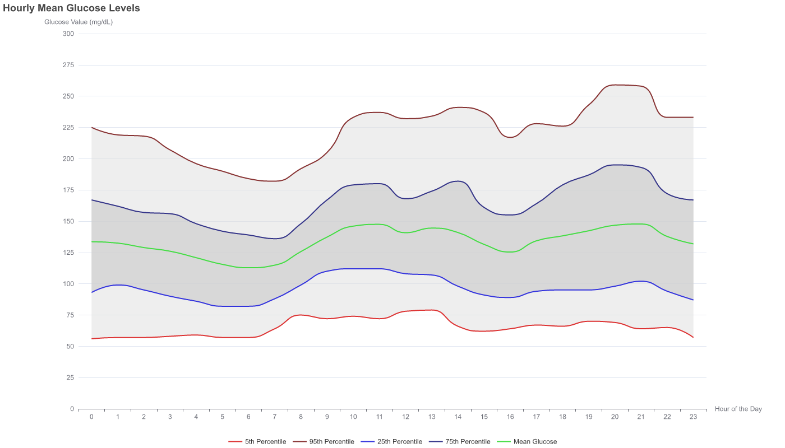

# DexCom Glucose Level Plot

This is a program that creates a plot of the exported DexCom data (a csv from
the clarity website). There are instructions on how to obtain the export on
[the dexcom FAQ page](https://www.dexcom.com/faqs/can-i-export-raw-data).
You might need to chose the right clarity website region. For europe it is
clarity.dexcom.eu (probably for the data protection reasons).

# Example

Running `cargo run -- example/example_export_data.csv` produces this plot:



# Usage

```
❱ ./dv-rs
Usage: dv-rs <csv_file_path>
```

# Building and running the program from scratch

Install the [rust tool chain](https://rustup.rs/), and then run the program
`cargo run -- <path_to_csv>`. Give it a little time. Resulting plot will be in
a file called `glucose_levels.png`

# Disclaimer

Most of the rust code has been generated by prompts to https://claude.ai/ as I
am only starting to learn Rust. While the code is working on a complete file,
there might be subtle issues that I haven't thought of yet. Treat it as a work
in progress.
